# ScooterMap

Community-Karte für Roller-, Mofa- und Mopedstrecken in Deutschland.

## Funktionen

- OpenStreetMap-Karte mit Leaflet
- **"Meldung einreichen"** – geführter Schritt-für-Schritt-Wizard auf Mobile, übersichtliches Formular auf Desktop
- Marker, Kreis-Gebiete und freie Flächen
- Kategorien: Fahrbahn, Sicherheit, Community, Warnungen + Schweregrad
- Details als schwebende Card (kein Bottom-Sheet)
- Voting: "Existiert noch" / "Nicht mehr da" – bei 5 Disputes wird der Eintrag gelöscht
- Satellitenansicht (ESRI) umschaltbar, in Satellitenkacheln ohne Farbfilter
- Farbschema **AUTO / HELL / DUNKEL** (folgt standardmäßig dem System)
- Geräteübergreifende Speicherung über MySQL/MariaDB
- Automatischer Sync zwischen Geräten über die API
- Lokaler `localStorage`-Fallback, wenn die API nicht läuft

## Icons

Alle Icons stammen aus der MDI-Bibliothek von Pictogrammers. Das komplette
Icon-Set ist Open Source (Apache License 2.0) – Danke dafür.

- Icon-Bibliothek und Übersicht: <https://pictogrammers.com/library/mdi/>
- Quellcode und Lizenz: <https://github.com/Templarian/MaterialDesign>

## Datenbank

Die App erwartet eine MySQL/MariaDB-Datenbank:

- Host für den Node-Server: standardmäßig `127.0.0.1`
- User: `root`
- Passwort: `root`
- Datenbank: `scootermap`
- Kollation: `utf8mb4_uca1400_ai_ci`

Die Tabellen werden beim Start von `server.js` automatisch angelegt. Alternativ kannst du `schema.sql` manuell ausführen.

Wichtig: Der Browser und das Handy sprechen nicht direkt mit MariaDB, sondern mit dem Node-Server. Wenn Node auf demselben Rechner wie MariaDB läuft, ist `127.0.0.1` korrekt. Die LAN-IP nutzt du nur zum Öffnen der Website vom Handy aus.

## Start

```bash
npm install
npm start
```

Danach im Browser öffnen:

```text
http://localhost:3000
```

Im LAN auf dem Handy oder PC verwendest du die IP des hostenden PCs, z.B.:

```text
http://192.168.xx.xxx:3000
```

## Bootstrap Und Seed

Tabellen ohne Testdaten anlegen:

```bash
npm run db:bootstrap
```

Tabellen anlegen und Demo-Einträge einfügen, falls `reports` leer ist:

```bash
npm run db:seed
```

Beim Öffnen der App werden vorhandene lokale Browser-Einträge automatisch in die Datenbank übernommen, wenn die API erreichbar und die Datenbank noch leer ist.

## Standort Auf Dem Handy

iOS und moderne Browser erlauben Standortzugriff nur in sicheren Kontexten. `localhost` funktioniert auf dem eigenen Gerät, eine normale LAN-Adresse per `http://...` auf dem iPhone meistens nicht. Für echten Handy-Standort brauchst du später HTTPS, z.B. über einen Reverse Proxy mit Zertifikat.

## Changelog

### 1.3

- Komplett neue Oberfläche im Terminal-Look (Designsprache von `DA6PHI.darc.de`)
- Logos entfernt, stattdessen Monospace-Typografie und MDI-Icons
- Icons von Unicode-/Emoji-Symbolen auf Material Design Icons umgestellt
- Farbschema-Schalter mit drei Stufen: `AUTO` → `HELL` → `DUNKEL`, Auswahl wird gespeichert
- Kategorie-Farben aus CSS-Variablen, damit sie sich mit dem Farbschema ändern
- Karte im Terminal-Look entsättigt, Satellitenkacheln bleiben ungefiltert
- Versionsanzeige `v1.3` in der Kopfzeile

## Screenshots

### Mobil

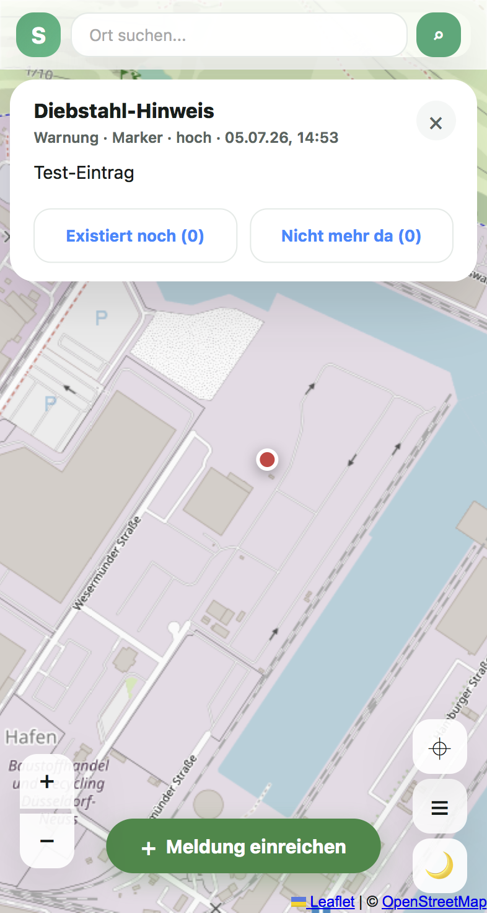
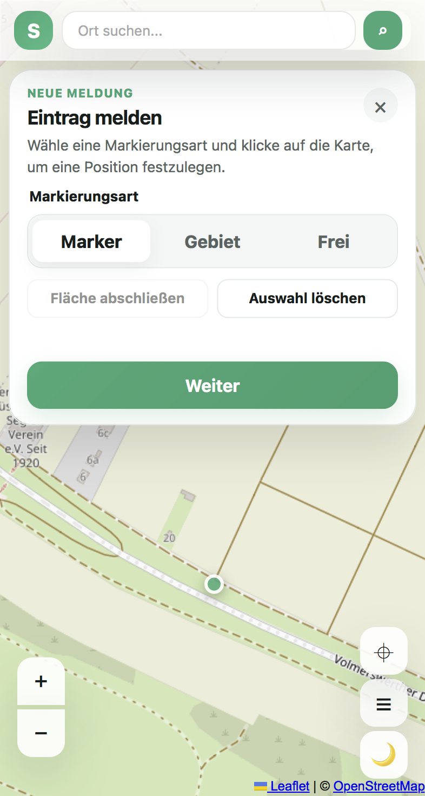
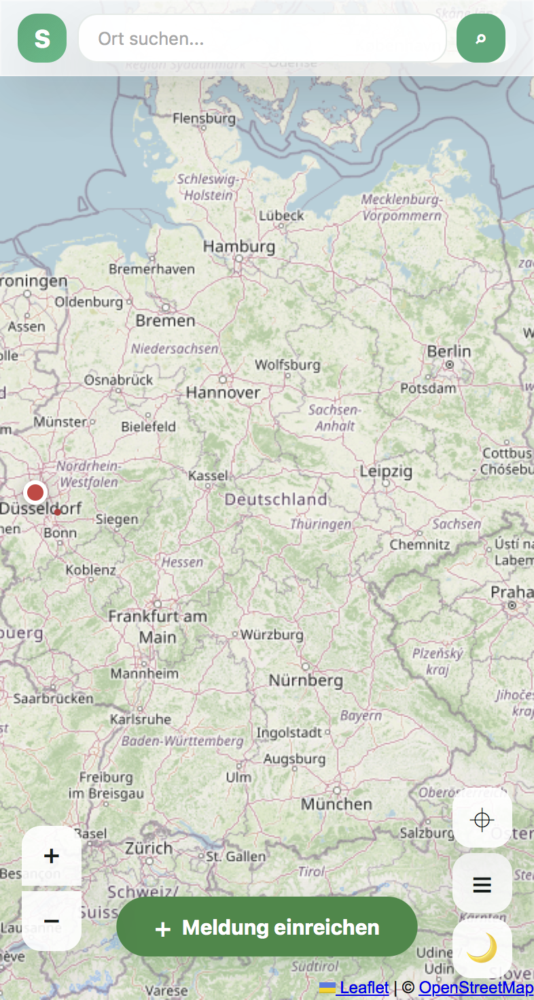
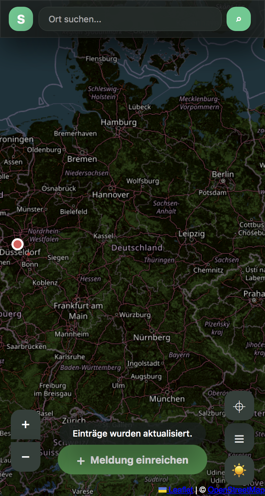
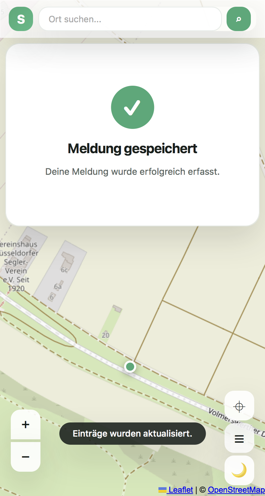

### Desktop

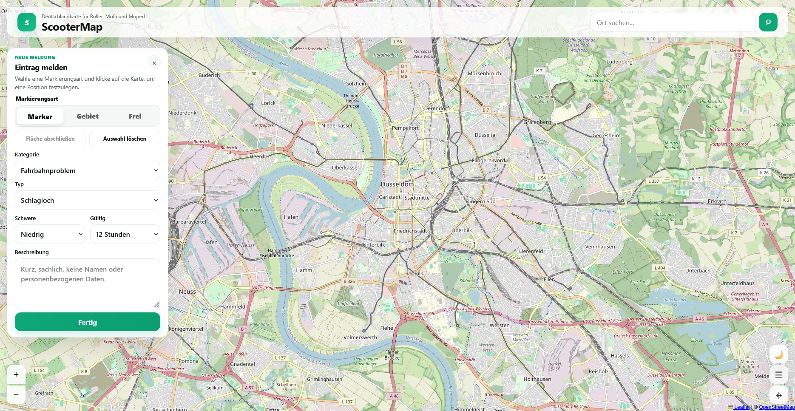
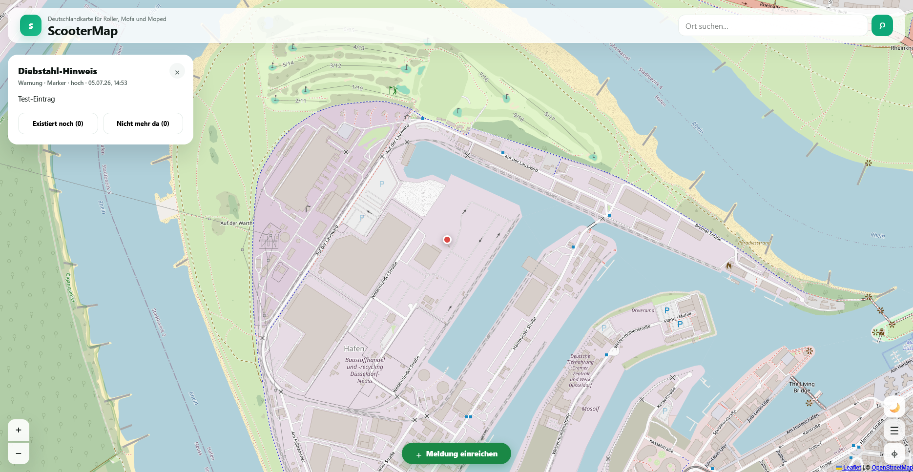
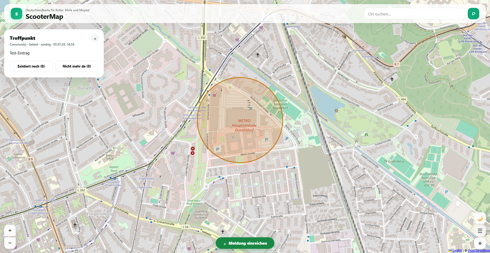
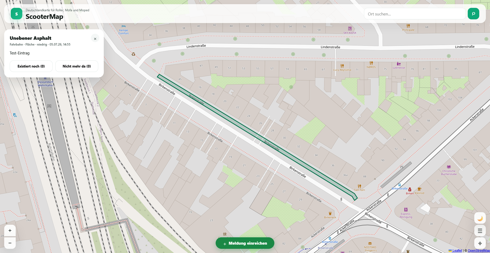
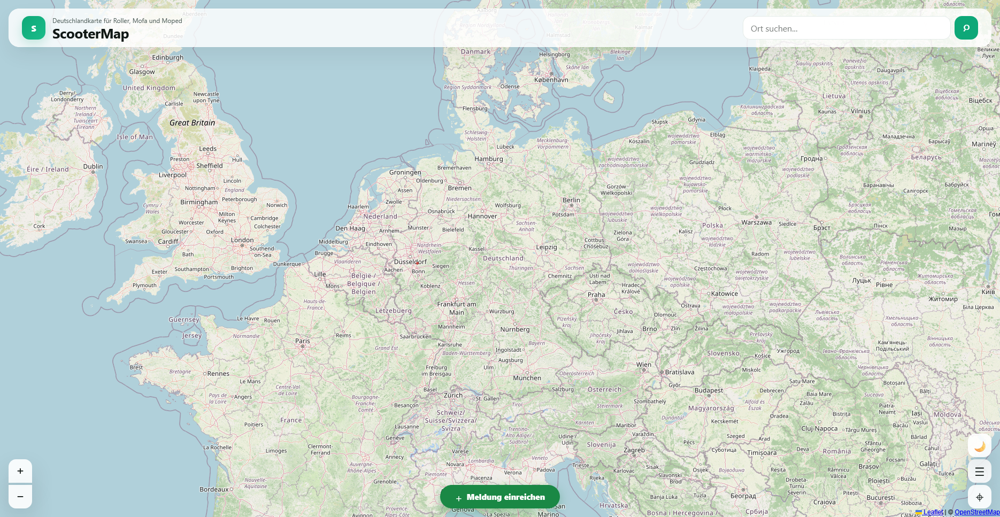
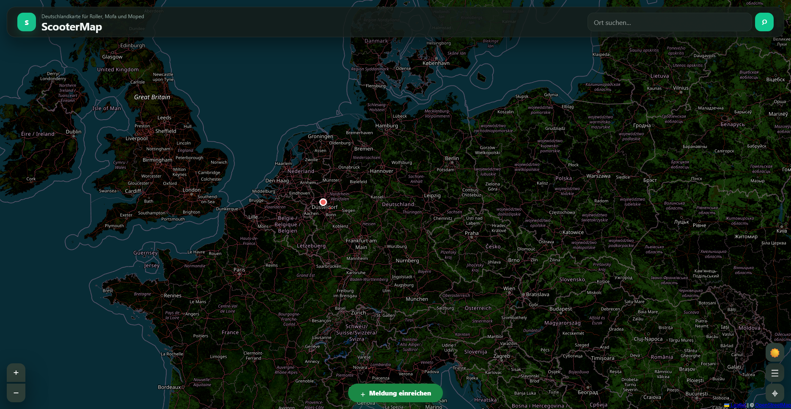
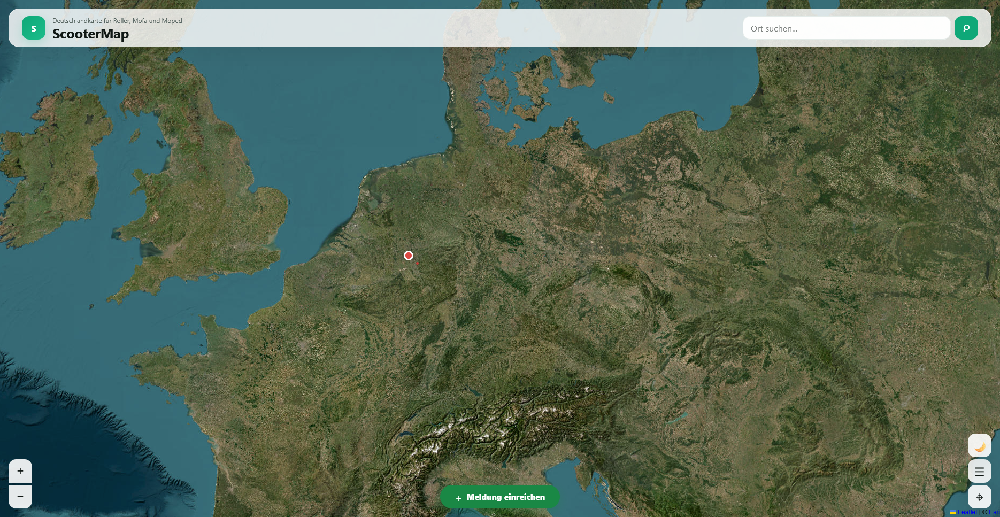

> **Hinweis:** Die Screenshots zeigen noch die Oberfläche von Version 1.2 und
> werden bei Gelegenheit neu erstellt.

## Danke

- **[Material Design Icons](https://pictogrammers.com/library/mdi/)** von
  [Pictogrammers](https://pictogrammers.com/) – das komplette Icon-Set,
  Apache License 2.0. Ohne diese Icons gäbe es keine Buttons, Marker oder
  Schalter in diesem Projekt.
- **[Share Tech Mono](https://fonts.google.com/specimen/Share+Tech+Mono)** und
  **[JetBrains Mono](https://fonts.google.com/specimen/JetBrains+Mono)** von
  [Google Fonts](https://fonts.google.com/), SIL Open Font License 1.1.
- **[Leaflet](https://leafletjs.com/)** – BSD-2-Clause.
- **Kartenmaterial** von [OpenStreetMap](https://www.openstreetmap.org/copyright)
  (ODbL) und [Esri](https://www.esri.com/) (Satellitenansicht).

**&copy; PhilTec-Philip. Alle Rechte vorbehalten.**
